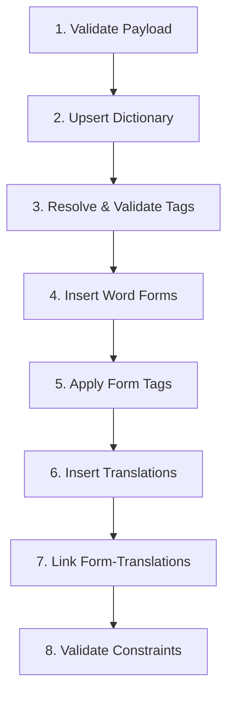

# Misti Word Loader System Architecture

> **💡 Complete Reference Guide**
> This document explains the `load_lexical_entry` function - a powerful SQL function that allows you to insert complete Italian words with all their forms, translations, and metadata in a single operation.

---

## Table of Contents

1. [System Overview](#1-system-overview)
2. [Function Implementation](#2-function-implementation)
3. [How The Loader Works](#3-how-the-loader-works)
4. [Payload Schema Reference](#4-payload-schema-reference)
5. [IPA & Phonetic Pronunciation Guidelines](#5-ipa--phonetic-pronunciation-guidelines)
6. [Step-by-Step Usage Guide](#6-step-by-step-usage-guide)
7. [Configuration Options](#7-configuration-options)
8. [Validation Rules & Constraints](#8-validation-rules--constraints)
9. [Examples & Templates](#9-examples--templates)
10. [Troubleshooting Guide](#10-troubleshooting-guide)

---

## 1. System Overview

### 1.1 What is the Word Loader?

The Misti Word Loader is a **single SQL function** that can insert or update a complete Italian lexical entry in one atomic operation. Instead of manually inserting into multiple tables, you provide a JSON payload containing all the data, and the function handles:

- ✅ **Dictionary entries** (lemma, word type, pronunciations)
- ✅ **Word-level metadata** (conjugation type, CEFR level, frequency)
- ✅ **Multiple translations** with their own metadata
- ✅ **Complete conjugated forms** with grammatical tags
- ✅ **Form-translation assignments** with confidence scoring
- ✅ **Validation** of all grammatical rules and constraints
- ✅ **Idempotency** - safe to run multiple times

### 1.2 Why Use the Word Loader?

**🎯 Consistency**: Ensures all related data is inserted together or not at all (transactional)
**🔒 Safety**: Validates grammatical rules and prevents invalid combinations
**⚡ Efficiency**: Single operation instead of dozens of individual INSERTs
**🔄 Idempotency**: Can be run repeatedly without creating duplicates
**📝 Documentation**: Self-documenting through structured JSON payloads

### 1.3 When to Use the Word Loader

- **✅ Seeding canonical verbs** (parlare, essere, correre, etc.)
- **✅ Adding new vocabulary** with complete conjugations
- **✅ Bulk imports** from external lexical resources
- **✅ Testing scenarios** with comprehensive word data
- **✅ Migration scripts** when restructuring data

---

## 2. Function Implementation

### 2.1 Function Signature

```sql
create or replace function public.load_lexical_entry(payload jsonb)
returns uuid
language plpgsql
```

**Parameters**:
- `payload`: JSON object containing complete word data

**Returns**:
- `uuid`: The `dictionary.id` of the created/updated word

### 2.2 Complete Function Code

```sql
create or replace function public.load_lexical_entry(payload jsonb)
returns uuid
language plpgsql
as $$
declare
  v_word_id uuid;
  v_word_type text;
  v_ipa text;
  v_phon text;
  v_audio text;
  v_italian text;
  v_strict boolean := coalesce((payload#>>'{options,strict}')::boolean, false);
  v_allow_prio boolean := coalesce((payload#>>'{options,allow_priority_override}')::boolean, true);
  v_update_ft text := coalesce(payload#>>'{options,update_form_translation}', 'merge');
  v_validate_only boolean := coalesce((payload#>>'{options,validate_only}')::boolean, false);

  procedure assert(cond boolean, msg text) is begin
    if not cond then raise exception '%', msg; end if;
  end;

begin
  assert(payload is not null, 'payload cannot be null');
  v_italian := payload->>'italian';
  v_word_type := lower(payload->>'word_type');
  v_ipa := nullif(payload->>'ipa','');
  v_phon := nullif(payload->>'phonetic','');
  v_audio := nullif(payload->>'audio_filename','');
  assert(v_italian is not null and v_word_type is not null, 'payload must include italian (lemma) and word_type');

  -- 1) Upsert dictionary (skipped on validate_only)
  if not v_validate_only then
    insert into dictionary (italian, word_type, ipa_pronunciation, phonetic_pronunciation, audio_filename)
    values (v_italian, v_word_type, v_ipa, v_phon, v_audio)
    on conflict (italian, word_type) do update
      set ipa_pronunciation = coalesce(excluded.ipa_pronunciation, dictionary.ipa_pronunciation),
          phonetic_pronunciation = coalesce(excluded.phonetic_pronunciation, dictionary.phonetic_pronunciation),
          audio_filename = coalesce(excluded.audio_filename, dictionary.audio_filename)
    returning id into v_word_id;
  else
    select id into v_word_id from dictionary where italian=v_italian and word_type=v_word_type limit 1;
    if v_word_id is null then
      raise exception 'validate_only: word % (% ) does not exist yet; run without validate_only to insert.', v_italian, v_word_type;
    end if;
  end if;

  create temp table if not exists _resolved_tags (
    scope text,
    entity_type text,
    entity_id uuid,
    value_id uuid,
    attribute_id uuid,
    source_level text,
    derived_from text
  ) on commit drop;

  -- Helper to resolve tags (UUID value_id preferred, fallback stable_id+value)
  -- WORD TAGS
  with raw as (
    select 'word'::text entity_type, v_word_id::uuid entity_id,
           (t->>'value_id')::uuid value_id,
           t->>'attribute_stable_id' attribute_stable_id,
           t->>'value' value_label,
           coalesce(t->>'derived_from','loader') derived_from
    from jsonb_array_elements(coalesce(payload->'word_tags','[]'::jsonb)) t
  ), res as (
    select r.entity_type, r.entity_id,
           coalesce(r.value_id, mv.id) value_id,
           mv.attribute_id, ma.source_level, r.derived_from
    from raw r
    join meta_values mv on mv.id = coalesce(r.value_id, mv.id)
     and (r.value_id is not null or (mv.value=r.value_label and exists (
           select 1 from meta_attributes ma2 where ma2.id=mv.attribute_id and ma2.stable_id=r.attribute_stable_id)))
    join meta_attributes ma on ma.id=mv.attribute_id
  ) insert into _resolved_tags select 'word', entity_type, entity_id, value_id, attribute_id, source_level, derived_from from res;

  -- TRANSLATION TAGS (resolve by text)
  with tr as (
    select wt.id word_translation_id, t
    from word_translations wt
    join jsonb_array_elements(coalesce(payload->'translations','[]'::jsonb)) t
      on wt.word_id=v_word_id and wt.translation=t->>'translation'
  ), raw as (
    select 'word_translation'::text entity_type, tr.word_translation_id entity_id,
           (tag->>'value_id')::uuid value_id,
           tag->>'attribute_stable_id' attribute_stable_id,
           tag->>'value' value_label,
           coalesce(tag->>'derived_from','loader') derived_from
    from tr
    join jsonb_array_elements(coalesce(tr.t->'tags','[]'::jsonb)) tag on true
  ), res as (
    select r.entity_type, r.entity_id,
           coalesce(r.value_id, mv.id) value_id,
           mv.attribute_id, ma.source_level, r.derived_from
    from raw r
    join meta_values mv on mv.id = coalesce(r.value_id, mv.id)
     and (r.value_id is not null or (mv.value=r.value_label and exists (
           select 1 from meta_attributes ma2 where ma2.id=mv.attribute_id and ma2.stable_id=r.attribute_stable_id)))
    join meta_attributes ma on ma.id=mv.attribute_id
  ) insert into _resolved_tags select 'translation', entity_type, entity_id, value_id, attribute_id, source_level, derived_from from res;

  -- FORMS upsert (skipped fields on validate_only)
  if not v_validate_only then
    insert into word_forms (word_id, form_text, form_type, ipa_pronunciation, phonetic_pronunciation)
    select v_word_id,
           f->>'form_text',
           coalesce(nullif(f->>'form_type',''),'conjugation'),
           nullif(f->>'ipa',''),
           nullif(f->>'phonetic','')
    from jsonb_array_elements(coalesce(payload->'forms','[]'::jsonb)) f
    on conflict (word_id, form_text, form_type) do update
      set ipa_pronunciation = coalesce(excluded.ipa_pronunciation, word_forms.ipa_pronunciation),
          phonetic_pronunciation = coalesce(excluded.phonetic_pronunciation, word_forms.phonetic_pronunciation);
  end if;

  -- FORM TAGS (resolve using current word_forms rows)
  with frows as (
    select wf.id form_id, f
    from word_forms wf
    join jsonb_array_elements(coalesce(payload->'forms','[]'::jsonb)) f
      on wf.word_id=v_word_id and wf.form_text=f->>'form_text' and wf.form_type=coalesce(nullif(f->>'form_type',''),'conjugation')
  ), raw as (
    select 'form'::text entity_type, fr.form_id entity_id,
           (tag->>'value_id')::uuid value_id,
           tag->>'attribute_stable_id' attribute_stable_id,
           tag->>'value' value_label,
           coalesce(tag->>'derived_from','loader') derived_from
    from frows fr
    join jsonb_array_elements(coalesce(fr.f->'tags','[]'::jsonb)) tag on true
  ), res as (
    select r.entity_type, r.entity_id,
           coalesce(r.value_id, mv.id) value_id,
           mv.attribute_id, ma.source_level, r.derived_from
    from raw r
    join meta_values mv on mv.id = coalesce(r.value_id, mv.id)
     and (r.value_id is not null or (mv.value=r.value_label and exists (
           select 1 from meta_attributes ma2 where ma2.id=mv.attribute_id and ma2.stable_id=r.attribute_stable_id)))
    join meta_attributes ma on ma.id=mv.attribute_id
  ) insert into _resolved_tags select 'form', entity_type, entity_id, value_id, attribute_id, source_level, derived_from from res;

  -- SOURCE-LEVEL VALIDATION
  perform 1 from _resolved_tags r
   where (r.entity_type='word' and r.source_level not in ('word','any'))
      or (r.entity_type='word_translation' and r.source_level not in ('translation','any'))
      or (r.entity_type='form' and r.source_level not in ('form','any'));
  if found then
    raise exception 'Invalid tag source_level for one or more tags. Ensure attributes include form-level where needed (e.g., auxiliary).';
  end if;

  -- Apply EMVs (skip when validate_only)
  if not v_validate_only then
    insert into entity_meta_values (entity_type, entity_id, value_id, attribute_id, derived_from)
    select r.entity_type, r.entity_id, r.value_id, r.attribute_id, r.derived_from
    from _resolved_tags r
    left join entity_meta_values ev on ev.entity_type=r.entity_type and ev.entity_id=r.entity_id and ev.value_id=r.value_id
    where ev.entity_id is null;
  end if;

  -- TRANSLATIONS upsert (after EMVs; skip on validate_only)
  if not v_validate_only then
    insert into word_translations (word_id, translation, display_priority, frequency_estimate)
    select v_word_id,
           t->>'translation',
           coalesce((t->>'display_priority')::int, 1),
           coalesce((t->>'frequency_estimate')::numeric, null)
    from jsonb_array_elements(coalesce(payload->'translations','[]'::jsonb)) t
    on conflict (word_id, translation) do update
      set display_priority = case when v_allow_prio then coalesce(excluded.display_priority, word_translations.display_priority) else word_translations.display_priority end,
          frequency_estimate = coalesce(excluded.frequency_estimate, word_translations.frequency_estimate);
  end if;

  -- FORM_TRANSLATIONS (skip on validate_only)
  if not v_validate_only then
    with ft as (
      select ft_item->>'form_text' as form_text,
             ft_item->>'translation_key' as translation_key,
             ft_item->>'translation_text' as translation_text,
             nullif(ft_item->>'word_translation_id','')::uuid as word_translation_id,
             coalesce(ft_item->>'assignment_method','automatic-comprehensive') as assignment_method,
             coalesce((ft_item->>'confidence')::numeric, 0.95) as confidence
      from jsonb_array_elements(coalesce(payload->'form_translations','[]'::jsonb)) ft_item
    ), form_ids as (
      select id, form_text from word_forms where word_id=v_word_id
    ), wt_map as (
      select wt.id, t->>'key' as payload_key, wt.translation
      from word_translations wt
      left join jsonb_array_elements(coalesce(payload->'translations','[]'::jsonb)) t
        on wt.word_id=v_word_id and wt.translation=t->>'translation'
    ), resolved as (
      select fi.id as form_id,
             coalesce(ft.word_translation_id,
                      (select id from wt_map where payload_key = ft.translation_key limit 1),
                      (select id from word_translations where word_id=v_word_id and translation = ft.translation_text limit 1)) as word_translation_id,
             ft.assignment_method,
             ft.confidence
      from ft
      join form_ids fi on fi.form_text = ft.form_text
    )
    insert into form_translations (form_id, word_translation_id, translation, assignment_method, confidence_score)
    select r.form_id, r.word_translation_id, wt.translation, r.assignment_method,
           case when v_update_ft='replace' then r.confidence else coalesce(ft2.confidence_score, r.confidence) end
    from resolved r
    join word_translations wt on wt.id=r.word_translation_id
    left join form_translations ft2 on ft2.form_id=r.form_id and ft2.word_translation_id=r.word_translation_id
    on conflict (form_id, word_translation_id) do update
      set assignment_method = excluded.assignment_method,
          confidence_score = case when v_update_ft='replace' then excluded.confidence_score else form_translations.confidence_score end;
  end if;

  -- STRICT RULES & AUXILIARY TRACK VALIDATION
  if v_strict then
    -- Reciprocal plural-only
    perform 1
    from word_translations wt
    join entity_meta_values te_refl on te_refl.entity_type='word_translation' and te_refl.entity_id=wt.id
    join meta_values v_refl on v_refl.id=te_refl.value_id
    join meta_attributes a_refl on a_refl.id=v_refl.attribute_id and a_refl.stable_id='metaattr021' and v_refl.value='reciprocal'
    join entity_meta_values te_nr on te_nr.entity_type='word_translation' and te_nr.entity_id=wt.id
    join meta_values v_nr on v_nr.id=te_nr.value_id
    join meta_attributes a_nr on a_nr.id=v_nr.attribute_id and a_nr.stable_id='metaattr013' and v_nr.value in ('plural-only','singular-only')
    join form_translations ftx on ftx.word_translation_id=wt.id
    join word_forms f on f.id=ftx.form_id
    join entity_meta_values fe on fe.entity_type='form' and fe.entity_id=f.id
    join meta_values mvn on mvn.id=fe.value_id
    join meta_attributes man on man.id=mvn.attribute_id and man.stable_id='metaattr012' and mvn.value='singolare'
    where wt.word_id=v_word_id; if found then raise exception 'Strict: reciprocal plural-only violated.'; end if;

    -- Impersonal third-person only (finite moods)
    perform 1 from entity_meta_values we
    join meta_values wv on wv.id=we.value_id
    join meta_attributes wa on wa.id=wv.attribute_id and wa.stable_id='metaattr021' and wv.value='impersonal'
    join word_forms f on f.word_id=v_word_id
    join entity_meta_values fe on fe.entity_type='form' and fe.entity_id=f.id
    join meta_values vp on vp.id=fe.value_id
    join meta_attributes ap on ap.id=vp.attribute_id and ap.stable_id='metaattr014' and vp.value <> 'terza-persona'
    join entity_meta_values fm on fm.entity_type='form' and fm.entity_id=f.id
    join meta_values vm on vm.id=fm.value_id
    join meta_attributes am on am.id=vm.attribute_id and am.stable_id='metaattr010' and vm.value in ('indicativo','congiuntivo','condizionale','imperativo')
    where we.entity_type='word' and we.entity_id=v_word_id; if found then raise exception 'Strict: impersonal third-person-only violated.'; end if;

    -- Finite compound/progressive must include auxiliary in text (space check)
    perform 1 from word_forms f
    join entity_meta_values fe on fe.entity_type='form' and fe.entity_id=f.id
    join meta_values vt on vt.id=fe.value_id
    join meta_attributes at on at.id=vt.attribute_id and at.stable_id='metaattr022' and vt.value in ('compound','progressive')
    join entity_meta_values fp on fp.entity_type='form' and fp.entity_id=f.id
    join meta_values vp on vp.id=fp.value_id
    join meta_attributes ap on ap.id=vp.attribute_id and ap.stable_id='metaattr014'
    where f.word_id=v_word_id and position(' ' in f.form_text)=0; if found then raise exception 'Strict: finite compound/progressive require auxiliary text.'; end if;

    -- Compound forms must have form-level auxiliary tag
    perform 1 from word_forms f
    join entity_meta_values ftype on ftype.entity_type='form' and ftype.entity_id=f.id
    join meta_values vtype on vtype.id=ftype.value_id
    join meta_attributes atype on atype.id=vtype.attribute_id and atype.stable_id='metaattr022' and vtype.value='compound'
    join entity_meta_values fp on fp.entity_type='form' and fp.entity_id=f.id
    join meta_values vp on vp.id=fp.value_id
    join meta_attributes ap on ap.id=vp.attribute_id and ap.stable_id='metaattr014'
    left join entity_meta_values faux on faux.entity_type='form' and faux.entity_id=f.id
    left join meta_values vaux on vaux.id=faux.value_id
    left join meta_attributes aaux on aaux.id=vaux.attribute_id and aaux.stable_id='metaattr002'
    where f.word_id=v_word_id and aaux.id is null; if found then raise exception 'Strict: finite compound forms must include form-level auxiliary tag.'; end if;

    -- Mapping must respect translation-level auxiliary
    perform 1 from form_translations ft
    join word_forms f on f.id=ft.form_id and f.word_id=v_word_id
    join entity_meta_values ftype on ftype.entity_type='form' and ftype.entity_id=f.id
    join meta_values vtype on vtype.id=ftype.value_id
    join meta_attributes atype on atype.id=vtype.attribute_id and atype.stable_id='metaattr022' and vtype.value='compound'
    join entity_meta_values faux on faux.entity_type='form' and faux.entity_id=f.id
    join meta_values vaux on vaux.id=faux.value_id
    join meta_attributes aaux on aaux.id=vaux.attribute_id and aaux.stable_id='metaattr002'
    join word_translations wt on wt.id=ft.word_translation_id
    join entity_meta_values taux on taux.entity_type='word_translation' and taux.entity_id=wt.id
    join meta_values vtax on vtax.id=taux.value_id
    join meta_attributes a_tax on a_tax.id=vtax.attribute_id and a_tax.stable_id='metaattr002'
    where vaux.value <> vtax.value; if found then raise exception 'Strict: compound form auxiliary does not match translation auxiliary.'; end if;
  end if;

  return v_word_id;
end $$;
```

---

## 3. How The Loader Works

### 3.1 Processing Flow

The function processes your payload in **8 sequential steps**:



### 3.2 Step-by-Step Breakdown

#### **Step 1: Payload Validation**
- Checks required fields (`italian`, `word_type`)
- Validates JSON structure
- Parses configuration options

#### **Step 2: Dictionary Upsert**
- Creates or updates the main dictionary entry
- Uses `(italian, word_type)` as unique key
- Only updates pronunciation fields if provided

#### **Step 3: Tag Resolution & Validation**
- Resolves metadata tags using UUID or stable_id + value
- Validates that attribute source levels match entity types
- Prepares tag assignments for later application

#### **Step 4: Word Forms Insertion**
- Inserts all conjugated forms with pronunciations
- Uses `(word_id, form_text, form_type)` as unique key
- Defaults `form_type` to `'conjugation'` if not specified

#### **Step 5: Metadata Application**
- Applies resolved tags to words, forms, and translations
- Skips existing tag assignments (no duplicates)
- Uses `derived_from='loader'` to track source

#### **Step 6: Translation Insertion**
- Inserts word translations with priorities
- Uses `(word_id, translation)` as unique key
- Respects priority override settings

#### **Step 7: Form-Translation Linking**
- Creates the many-to-many relationships between forms and translations
- Resolves translation references by key, text, or UUID
- **REQUIRES COMPLETE COVERAGE**: Every form must link to every semantically appropriate translation
- **ENFORCES AUXILIARY CONSISTENCY**: Form auxiliary must match translation auxiliary
- Assigns assignment methods (confidence handled automatically)

#### **Step 8: Constraint Validation (Strict Mode)**
- Validates reciprocal plural-only rules
- Checks impersonal third-person restrictions
- Ensures compound forms have proper auxiliary tags
- Verifies auxiliary consistency between forms and translations

---

## 4. Payload Schema Reference

### 4.1 Top-Level Structure

```json
{
  "italian": "string (required)",
  "word_type": "string (required)",
  "ipa": "string (required for comprehensive seeding)",
  "phonetic": "string (required for comprehensive seeding)",
  "audio_filename": "string (optional)",
  "word_tags": "array (required for verbs)",
  "translations": "array (required - minimum 1 translation)",
  "forms": "array (required for verbs - EVERY SINGLE FORM across ALL moods/tenses)",
  "form_translations": "array (required - complete coverage matrix)",
  "options": "object (optional)"
}
```

**💡 Field Requirements Note**: While the function accepts optional fields, **comprehensive word seeding** requires all fields to ensure complete lexical entries. Only `audio_filename` and `options` are truly optional for production use.

**🚨 CRITICAL**: The `form_translations` array must contain **EVERY valid form-word_translation combination** respecting:
1. **Auxiliary compatibility** between form and word_translation
2. **Semantic appropriateness** of the form-translation pairing
3. **Grammatical restrictions** specific to the verb (e.g., third-person-only verbs)

This is NOT simply N×M entries - it's all valid combinations based on auxiliary matching, semantic compatibility, and verb-specific restrictions.

### 🎨 **New Translation Format Guidelines**

#### **📝 Semantic Grouping with Pipe Separators**
- **Format**: `"translation": "primary meaning|secondary meaning|tertiary meaning"`
- **Example**: `"to run|to dash|to sprint"` (motion verbs grouped by intensity)
- **Principle**: Group semantically related meanings using linguistic relationships

#### **📋 Usage Notes Instead of Context**
- **❌ Old Format**: `"to run (sport)"`, `"to run (quickly)"`
- **✅ New Format**: `"to run|to dash"` with `"usage_notes": "Athletic or rapid movement"`
- **Field**: Use `usage_notes` field for contextual information

#### **🔗 Linguistic Relationship Types**
- **Metonymy**: Related by association (`"hand"` → `"worker"`)
- **Metaphor**: Related by analogy (`"run"` → `"operate"`)
- **Specialization**: General → specific (`"drink"` → `"drink alcohol"`)
- **Generalization**: Specific → general (`"dog"` → `"animal"`)

---

## 4.2 Word-Level Attributes (Complete Reference)

### 4.2.1 Core Grammatical Attributes

#### **🔧 `metaattr004` - Conjugation Type** *(Required for Verbs)*
**📍 Source Level**: `word` | **🎯 When to Use**: All Italian verbs must specify their conjugation pattern

```json
{"attribute_stable_id": "metaattr004", "value": "are"}
```

**🎨 Available Values**:
- 🔹 `"are"` - First conjugation: `parlare`, `amare`, `studiare` (largest group, ~4000 verbs)
- 🔸 `"ere"` - Second conjugation: `credere`, `vendere`, `mettere` (many irregularities)
- 🔻 `"ire"` - Third conjugation: `dormire`, `partire`, `sentire` (regular pattern)
- ⭐ `"ire-isc"` - Third conjugation with -isc- infix: `finire`, `pulire`, `costruire`

**📋 Usage Guidelines**: Based on infinitive ending and morphological pattern. Use `-isc` variant only for verbs that actually insert -isc- in present tense forms (`finisco`, `finisci`, `finisce`).

#### **`metaattr017` - Reflexive** *(Required for Reflexive Verbs)*
**Source Level**: `word` | **When to Use**: Verbs requiring reflexive pronouns (lavarsi vs lavare)

```json
{"attribute_stable_id": "metaattr017", "value": "reflexive"}
```

**Available Values**:
- `"reflexive"` - Requires reflexive pronouns: lavarsi, alzarsi, vestirsi

**Usage Guidelines**: Apply to verbs that are inherently reflexive and require clitic pronouns (mi, ti, si, ci, vi, si) as part of their core meaning.

---

### 4.2.2 Learning & Pedagogical Attributes

#### **`metaattr003` - CEFR Level** *(Required for Learning Applications)*
**Source Level**: `word` | **When to Use**: All vocabulary for learning progression

```json
{"attribute_stable_id": "metaattr003", "value": "A1"}
```

**Available Values & Usage**:
- `"A1"` - Absolute beginner: essere, avere, parlare, mangiare (survival vocabulary)
- `"A2"` - Elementary: credere, alzarsi, preferire (personal information)
- `"B1"` - Intermediate: accorgersi, convincere, costruire (familiar topics)
- `"B2"` - Upper-intermediate: distinguere, manifestare (complex topics)
- `"C1"` - Advanced: conciliare, rivendicare (sophisticated communication)
- `"C2"` - Proficiency: pervadere, scaturire (near-native competence)
- `"native"` - Native speaker vocabulary: highly specialized terms
- `"academic"` - Academic terminology: dissertare, postulare
- `"business"` - Business vocabulary: fatturare, commercializzare
- `"literary"` - Literary usage: tramontare, dileguare
- `"regional"` - Regional/dialectal: specific geographic usage
- `"specialized"` - Technical/domain-specific: terms for specific fields

**CEFR Level Sources**:
- Common European Framework standards and guidelines
- Italian language textbook analysis (Nuovo Espresso, Bravissimo series)
- Teacher and linguist expert assessment
- Learning progression research from language schools

#### **`metaattr007` - Frequency Tier** *(Required for Learning Priority)*
**Source Level**: `word` | **When to Use**: All vocabulary for usage-based learning

```json
{"attribute_stable_id": "metaattr007", "value": "top100"}
```

**Available Values & Usage**:
- `"top100"` - Most essential: essere, avere, fare, dire, andare
- `"top500"` - High frequency: parlare, vedere, sapere, dare
- `"top1000"` - Common vocabulary: credere, portare, lasciare
- `"top2500"` - Extended vocabulary: costruire, nascondere
- `"top5000"` - Comprehensive vocabulary: sussurrare, sbirciare
- `"top10000"` - Full vocabulary range: archaic and specialized terms

**📊 Frequency Tier Sources**:
- 🏛️ **Italian National Corpus (CORIS/CODIS)** - Academic corpus analysis
- 📰 **Newspaper and media studies** - La Repubblica, Corriere della Sera frequency analysis
- 🗣️ **Spoken Italian corpus (C-ORAL-ROM)** - Conversational language patterns
- 📚 **Academic frequency lists** - De Mauro, Sabatini-Coletti lexicographic research
- ⭐ **PAISÀ Corpus Top 10K** - `paisa_top10k_with_pos.xlsx` (280KB) - Authoritative frequency rankings with lemma, POS tags, and precise frequency counts from large web corpus of contemporary Italian texts (Creative Commons licensed)
- 📈 **Statistical analysis** - Contemporary Italian text frequency analysis

**🎯 Primary Frequency Source**: The **PAISÀ Top 10K** file provides the definitive ranking system for frequency tier assignments, with each lemma positioned according to actual usage frequency in contemporary Italian web texts.

---

## **🚨 MANDATORY: Complete Verb Form Generation**

### **📋 ALL Forms Required**
When seeding verbs, you **MUST** generate **EVERY SINGLE FORM** across all grammatical categories:

**Required Moods & Tenses**:
- **Infinito**: presente, passato
- **Participio**: presente, passato
- **Gerundio**: presente, passato
- **Indicativo**: presente, imperfetto, passato remoto, futuro semplice, passato prossimo, trapassato prossimo, futuro anteriore
- **Congiuntivo**: presente, imperfetto, passato, trapassato
- **Condizionale**: presente, passato
- **Imperativo**: presente

**Required Persons & Numbers** (for finite forms):
- Prima persona: singolare, plurale
- Seconda persona: singolare, plurale
- Terza persona: singolare, plurale

### **🎯 Total Form Count**
A complete Italian verb conjugation typically contains **~100-140 forms** depending on:
- Irregular variations
- Auxiliary requirements (avere vs essere)
- Defective restrictions (missing persons/moods)

### **⚡ Form-Translation Matrix**
If your verb has **N forms** and **M translations**, you need **N×M form_translation entries**:
- 100 forms × 3 translations = **300 form_translation entries**
- **NO SHORTCUTS** - every form must map to every semantically appropriate translation

#### **📋 Using PAISA for Frequency Tier Assignment**:
```
Rank 1-100     → frequency_tier: "top100"
Rank 101-500   → frequency_tier: "top500"
Rank 501-1000  → frequency_tier: "top1000"
Rank 1001-2500 → frequency_tier: "top2500"
Rank 2501-5000 → frequency_tier: "top5000"
Rank 5001-10000→ frequency_tier: "top10000"
```

**File Location**: `/documentation/architecture/paisa_top10k_with_pos.xlsx`
**Content**: Ranked Italian lemmas with POS tags from PAISÀ web corpus analysis
**Usage**: Reference lemma position in file to determine appropriate frequency_tier value

**Materialization Priority**: High-frequency + low-CEFR verbs receive complete 130-form sets first (top100 + A1 = highest priority).

---

### 4.2.3 Behavioral Pattern Attributes

#### **🚧 `metaattr013` - Number Restriction** *(When Applicable)*
**📍 Source Level**: `word` | **🎯 When to Use**: Verbs with grammatical or semantic constraints

```json
{"attribute_stable_id": "metaattr013", "value": "third-person-only"}
```

**🎨 Available Values & Implementation Status**:
- ✅ `"plural-only"` - Semantic plural requirement (reciprocal meanings) - **IMPLEMENTED**
- ✅ `"singular-only"` - Semantic singular requirement (rare) - **IMPLEMENTED**
- ⚠️ `"third-person-only"` - **DO NOT USE FOR IMPERSONAL VERBS** - Only for genuinely defective verbs that cannot conjugate in 1st/2nd person - **IMPLEMENTED**
- ✅ `"third-singular-only"` - **GENUINE RESTRICTION**: Weather verbs that can ONLY exist in 3rd person singular: `piovere`, `nevicare`, `grandinare` - generates only 48 forms - **IMPLEMENTED**
- ✅ `"missing-first-second-person"` - Defective verbs: `vigere`, `urgere` - **IMPLEMENTED**
- ✅ `"missing-imperative"` - Defective verbs: `solere` (cannot form commands) - **IMPLEMENTED**

**📋 Usage Guidelines**:

**CRITICAL DISTINCTION - Impersonal vs. Third-Person-Only**:

**Impersonal Verbs** (importare "to matter", piacere "to like", andare "to feel like"):
- ✅ Use `verb_type: "impersonal"` attribute (NOT a restriction)
- ✅ Generate ALL 130 forms (all persons, all tenses, all moods)
- ✅ Use 3rd person forms (BOTH singular and plural) with indirect pronouns to express all persons
  - **Singular subject**: mi importa, ti importa, gli/le importa, ci importa, vi importa, gli importa
  - **Plural subject**: mi importano, ti importano, gli/le importano, ci importano, vi importano, gli importano
- ✅ Number agreement: Verb number agrees with grammatical SUBJECT, not the person (indirect pronoun)
- ✅ Semantic pattern: [Indirect pronoun] + [3rd person verb (sg/pl)] + [subject/infinitive]
- ❌ Do NOT use `restriction: "third-person-only"`

**Third-Person-Only/Weather Verbs** (piovere "to rain", nevicare "to snow"):
- ✅ Use `restriction: "third-singular-only"` for weather verbs
- ✅ Generate ONLY 48 forms (3rd person only, no imperatives)
- ✅ Genuinely defective - cannot conjugate in other persons
- ❌ Do NOT use `verb_type: "impersonal"`

**⚡ Function Implementation Status**: **ALL RESTRICTIONS IMPLEMENTED**
- ✅ **Weather verbs**: `third-singular-only` validation prevents non-third-person or non-singular forms
- ✅ **Defective verbs**: `missing-first-second-person` validation prevents first/second person forms
- ✅ **Defective verbs**: `missing-imperative` validation prevents imperative mood forms
- ✅ **Semantic restrictions**: `singular-only` validation prevents plural forms for semantically singular words
- ✅ **Reciprocal verbs**: `plural-only` validation prevents singular forms for reciprocal meanings
- ✅ **Impersonal verbs**: `third-person-only` validation prevents non-third-person forms

**🚀 Production Ready**: Complete behavioral restriction coverage ensures grammatically correct Italian verb form validation

---

## 4.3 Translation-Level Attributes (Complete Reference)

### 4.3.1 Core Grammatical Attributes

#### **`metaattr002` - Auxiliary** *(Required for All Verbs)*
**Source Level**: `translation` | **When to Use**: Every verb translation must specify auxiliary

```json
{"attribute_stable_id": "metaattr002", "value": "avere"}
```

**Available Values**:
- `"avere"` - Transitive actions, creation, general activities: ho parlato, ho mangiato
- `"essere"` - Motion, state changes, existence changes, reflexive actions: sono andato, mi sono lavato

**Usage Guidelines**:
- **Avere**: Transitive verbs, activities without state change (parlare, mangiare, lavorare)
- **Essere**: Motion with destination (andare, venire), state changes (diventare, morire), reflexive verbs (lavarsi)
- **Validation**: Must align with transitivity - transitive typically uses avere, intransitive typically uses essere

#### **`metaattr020` - Transitivity** *(Required for All Verbs)*
**Source Level**: `translation` | **When to Use**: Every verb translation must specify object-taking capability

```json
{"attribute_stable_id": "metaattr020", "value": "transitive"}
```

**Available Values**:
- `"transitive"` - Takes direct objects: mangiare una mela, vedere qualcosa
- `"intransitive"` - Cannot take direct objects: andare, dormire, esistere
- `"ambitransitive"` - Single meaning usable both ways: correre (una gara) / correre (velocemente)

**Usage Guidelines**: Based on whether the specific translation meaning can take direct objects. Same verb can have different transitivity for different meanings.

---

### 4.3.2 Semantic Classification Attributes

#### **`metaattr021` - Verb Type** *(When Applicable)*
**Source Level**: `translation` | **When to Use**: Special behavioral patterns or semantic restrictions

```json
{"attribute_stable_id": "metaattr021", "value": "modal-verb"}
```

**Available Values & Usage**:
- `"modal-verb"` - Auxiliary modals: dovere (must), potere (can), volere (want), sapere (know how)
- `"direct-reflexive"` - Action on oneself: mi lavo (I wash myself)
- `"reciprocal"` - Mutual action: ci laviamo (we wash each other) - **must combine with plural-only restriction**
- `"impersonal-verb"` - **USAGE PATTERN, NOT RESTRICTION**: Verbs using indirect object pronouns with 3rd person forms (BOTH singular and plural) to express all persons. Pattern: mi importa/importano, ti piace/piacciono, gli va/vanno (verb number agrees with grammatical subject, not person). Generate ALL 130 forms. Examples: importare (matter), bisognare (need), piacere (to like), andare (to feel like). Do NOT use with `restriction: "third-person-only"`
- `"defective-verb"` - Missing some forms: vigere (be in force), solere (be accustomed)
- `"meteorological-verb"` - **GENUINE RESTRICTION**: Weather phenomena that can ONLY conjugate in 3rd person singular: piovere (rain), nevicare (snow), grandinare (hail). Use with `restriction: "third-singular-only"` to generate only 48 forms

**Deprecated Values** *(Do Not Use)*:
- `"transitive-verb"`, `"intransitive-verb"`, `"intransitive"` - Use `transitivity` attribute instead

**Usage Guidelines**:
- **Modal verbs**: Can take bare infinitives, auxiliary selection varies based on dependent verb
- **Reflexive/Reciprocal**: Reflexive verbs must have both direct-reflexive AND reciprocal translations
- **Impersonal**: CRITICAL - This is a USAGE PATTERN attribute, not a form restriction. Impersonal verbs generate all 130 forms and use 3rd person forms with indirect object pronouns (mi/ti/gli/le/ci/vi/gli) to express all persons semantically. Pattern: [Indirect pronoun] + [3rd person verb] + [subject]. Example: "mi importa" = "to me it matters" (all persons expressed via pronouns, not verb conjugation)
- **Meteorological**: These are genuinely defective - they can ONLY exist in 3rd person singular. Use the `restriction` attribute, not `verb_type`

---

### 4.3.3 Contextual Attributes

#### **`metaattr018` - Register** *(When Applicable)*
**Source Level**: `translation` | **When to Use**: Sociolinguistic appropriateness varies

```json
{"attribute_stable_id": "metaattr018", "value": "formal"}
```

**Available Values**:
- `"formal"` - Academic, professional, official contexts: dissertare, postulare
- `"casual"` - Colloquial, everyday conversation: chiacchierare, sgridare
- `"neutral"` - Standard register, neither formal nor informal: parlare, dire
- `"mixed"` - Appropriate in both formal and informal contexts: essere, avere

**Usage Guidelines**: Apply when translation appropriateness varies by social context. Most common verbs are neutral/mixed.

#### **`metaattr008` - Gender Usage** *(When Applicable)*
**Source Level**: `translation` | **When to Use**: Gender-specific meanings

```json
{"attribute_stable_id": "metaattr008", "value": "male-only"}
```

**Available Values**:
- `"male-only"` - Translation only for male subjects: Some appearance terms
- `"female-only"` - Translation only for female subjects: Some appearance terms

**Usage Guidelines**: Rare attribute for gendered interpretations of certain adjectives/verbs.

---

## 4.4 Form-Level Attributes (Complete Reference)

### 4.4.1 Core Grammatical Tags (Required for All Verb Forms)

#### **`metaattr010` - Mood** *(Required)*
**Source Level**: `form` | **When to Use**: All conjugated verb forms

```json
{"attribute_stable_id": "metaattr010", "value": "indicativo"}
```

**Available Values & Usage**:
- `"indicativo"` - Factual statements: parlo, parlavo, ho parlato
- `"congiuntivo"` - Doubt, emotion, opinion: che parli, che parlassi
- `"condizionale"` - Hypothetical situations: parlerei, avrei parlato
- `"imperativo"` - Commands: parla!, parlate!
- `"infinito"` - Unconjugated forms: parlare, aver parlato
- `"participio"` - Verbal adjectives: parlante, parlato
- `"gerundio"` - Verbal nouns: parlando, avendo parlato

#### **`metaattr019` - Tense** *(Required)*
**Source Level**: `form` | **When to Use**: All conjugated verb forms

```json
{"attribute_stable_id": "metaattr019", "value": "presente"}
```

**Available Values** (Complete List):
**Indicative Tenses**:
- `"presente"` - Present: parlo, parli, parla
- `"imperfetto"` - Imperfect: parlavo, parlavi, parlava
- `"passato-remoto"` - Simple past: parlai, parlasti, parlò
- `"futuro-semplice"` - Simple future: parlerò, parlerai, parlerà
- `"passato-prossimo"` - Present perfect: ho parlato, hai parlato
- `"trapassato-prossimo"` - Past perfect: avevo parlato
- `"futuro-anteriore"` - Future perfect: avrò parlato
- `"trapassato-remoto"` - Past anterior: ebbi parlato

**Subjunctive Tenses**:
- `"congiuntivo-presente"` - Present subjunctive: che parli
- `"congiuntivo-imperfetto"` - Imperfect subjunctive: che parlassi
- `"congiuntivo-passato"` - Present perfect subjunctive: che abbia parlato
- `"congiuntivo-trapassato"` - Past perfect subjunctive: che avessi parlato

**Conditional Tenses**:
- `"condizionale-presente"` - Present conditional: parlerei
- `"condizionale-passato"` - Past conditional: avrei parlato

**Progressive Tenses**:
- `"presente-progressivo"` - Present progressive: sto parlando
- `"passato-progressivo"` - Past progressive: stavo parlando
- `"futuro-progressivo"` - Future progressive: starò parlando
- `"congiuntivo-presente-progressivo"` - Subjunctive progressive: che stia parlando
- `"condizionale-presente-progressivo"` - Conditional progressive: starei parlando

**Non-finite Tenses**:
- `"infinito-presente"` - Present infinitive: parlare
- `"infinito-passato"` - Past infinitive: aver parlato
- `"participio-presente"` - Present participle: parlante
- `"participio-passato"` - Past participle: parlato
- `"gerundio-presente"` - Present gerund: parlando
- `"gerundio-passato"` - Past gerund: avendo parlato

**Imperative Tenses**:
- `"imperativo-presente"` - Present imperative: parla!, parlate!
- `"imperativo-passato"` - Past imperative: abbi parlato! (rare)

#### **`metaattr014` - Person** *(Required for Finite Forms)*
**Source Level**: `form` | **When to Use**: All conjugated forms with subject agreement

```json
{"attribute_stable_id": "metaattr014", "value": "prima-persona"}
```

**Available Values**:
- `"prima-persona"` - First person: io, noi
- `"seconda-persona"` - Second person: tu, voi
- `"terza-persona"` - Third person: lui/lei, loro

**Usage Guidelines**: Not applicable to infinitive, participle, or gerund forms which are non-finite.

#### **`metaattr012` - Number** *(Required for Finite Forms)*
**Source Level**: `form` | **When to Use**: All conjugated forms with subject agreement

```json
{"attribute_stable_id": "metaattr012", "value": "singolare"}
```

**Available Values**:
- `"singolare"` - Singular: io, tu, lui/lei
- `"plurale"` - Plural: noi, voi, loro

#### **`metaattr022` - Verb Form Type** *(Required)*
**Source Level**: `form` | **When to Use**: All verb forms must specify construction method

```json
{"attribute_stable_id": "metaattr022", "value": "simple"}
```

**Available Values**:
- `"simple"` - Single-word forms: parlo, parlavo, parlerò
- `"compound"` - Auxiliary + participle: ho parlato, sono andato
- `"progressive"` - Stare + gerund: sto parlando, stavo parlando

**Usage Guidelines**:
- **Simple**: Most finite forms and all non-finite forms except perfect infinitive/gerund
- **Compound**: All perfect tenses using avere/essere + past participle
- **Progressive**: All continuous tenses using stare + present gerund

---

### 4.4.2 Special Form Attributes

#### **`metaattr002` - Auxiliary** *(Required for Compound Forms)*
**Source Level**: `form` | **When to Use**: All compound tense forms must specify which auxiliary used

```json
{"attribute_stable_id": "metaattr002", "value": "avere"}
```

**Available Values**:
- `"avere"` - Compound forms with avere: ho parlato, avevo mangiato
- `"essere"` - Compound forms with essere: sono andato, era partito

**Usage Guidelines**: **Must match translation-level auxiliary assignment**. Form-level auxiliary specifies which auxiliary appears in the actual stored form text.

#### **`metaattr005` - Form Irregular** *(When Applicable)*
**Source Level**: `form` | **When to Use**: Forms that deviate from expected conjugation pattern

```json
{"attribute_stable_id": "metaattr005", "value": "irregular"}
```

**Available Values**:
- `"irregular"` - Deviates from pattern: vado (andare), sono (essere), faccio (fare)

**Usage Guidelines**: Apply to forms with stem changes, suppletion, or other unpredictable variations from standard conjugation patterns.

---

## 4.5 Form Translations Schema

**🚨 CRITICAL REQUIREMENTS**:

### **📋 Complete Form-Translation Coverage Matrix**
**MANDATORY**: Every single form must have translations for every semantically appropriate translation. This is a **hard requirement** - no exceptions.

### **🔧 Form Translation Structure**
```json
{
  "form_translations": [
    {
      "form_text": "credo",
      "translation_text": "I believe",
      "assignment_method": "automatic-comprehensive"
    },
    {
      "form_text": "credo",
      "translation_text": "I trust",
      "assignment_method": "automatic-comprehensive"
    },
    {
      "form_text": "ho creduto",
      "translation_text": "I have believed",
      "assignment_method": "automatic-comprehensive"
    }
  ]
}
```

### **⚡ Key Field Requirements**:
- **`form_text`**: Exact Italian form ("credo", "ho creduto", etc.)
- **`translation_text`**: **ACTUAL English translation** ("I believe", "you trust", "we have thought")
- **`assignment_method`**: Assignment type (defaults to "automatic-comprehensive")
- **NO `confidence` field needed** - confidence scoring is handled automatically

### **🎯 Auxiliary Consistency Rule**
**CRITICAL**: Form-level auxiliary must match the word_translation's auxiliary attribute:
- Forms with `auxiliary="avere"` can ONLY link to word_translations with `auxiliary="avere"`
- Forms with `auxiliary="essere"` can ONLY link to word_translations with `auxiliary="essere"`
- The auxiliary is determined by the word_translation entity, not the form_translation entry
- This is enforced in strict mode and will cause validation errors if violated

**Example**:
- `"ho finito"` (avere form) → can link to `"to finish"` (avere translation) → `"I have finished"`
- `"sono finito"` (essere form) → can link to `"to end"` (essere translation) → `"I have ended"`
- `"ho finito"` (avere form) → **CANNOT** link to `"to end"` (essere translation) ❌

### **📊 Complete Coverage Requirements**
**EVERY form must link to EVERY compatible word_translation**:
- **Auxiliary Compatibility**: Form auxiliary must match word_translation auxiliary
- **Semantic Appropriateness**: Form must be semantically compatible with translation meaning
- **Restriction Compliance**: Forms must respect verb restrictions (person, number, mood)

**Example Coverage Calculation**:
- Verb has 2 translations: `"to finish"` (avere) + `"to end"` (essere)
- Verb has 50 avere forms + 50 essere forms = 100 total forms
- Coverage: 50 avere forms × 1 avere translation + 50 essere forms × 1 essere translation = **100 form_translation entries**
- **NOT** 100 × 2 = 200, because auxiliary compatibility prevents cross-linking

### **🔗 Translation Resolution Methods**
The function resolves word_translations using (in priority order):
1. **`word_translation_id`** - Direct UUID reference to word_translations table
2. **`translation_key`** - Key from translations array in payload
3. **`translation_text`** - Direct text matching against word_translations.translation

**💡 Recommendation**: Use `translation_key` to reference specific word_translations, with `translation_text` providing the actual English form translation.

---

## 5. IPA & Phonetic Pronunciation Guidelines

### 5.1 IPA Format Standards

The **International Phonetic Alphabet (IPA)** entries should follow these conventions:

#### **Format Rules**:
- ✅ **Enclose in forward slashes**: `/parˈlare/`
- ✅ **Use proper IPA stress symbols**: Primary stress `ˈ`, secondary stress `ˌ`
- ✅ **Include syllable boundaries**: `/fi.ˈni.re/` (dots for clarity)
- ✅ **Use Italian IPA conventions**: `[ɲ]` for gn, `[ʎ]` for gl, `[ts]` for z

#### **Italian-Specific IPA Symbols**:
```
Consonants:
/ɲ/    - gn (bagno)
/ʎ/    - gl (figlio)
/ʃ/    - sc (pesce)
/ts/   - z (grazie)
/dz/   - z (zero)
/ʧ/    - c (ciao)
/ʤ/    - g (giorno)
/r/    - r (trilled)

Vowels:
/i/    - i (vino)
/e/    - e (bene)
/ɛ/    - è (caffè)
/a/    - a (casa)
/ɔ/    - ò (cuore)
/o/    - o (mondo)
/u/    - u (luna)
```

#### **🎯 Italian Stress Placement Rules**:
- 🔹 **Penultimate stress** (default ~80%): `/parˈlare/`, `/korˈrere/`, `/dorˈmire/`
- 🔸 **Ultimate stress** (oxytone): `/perˈke/`, `/ʧitˈta/`, `/kaˈfe/` - requires written accent
- 🔻 **Antepenultimate stress** (proparoxytone): `/ˈmediko/`, `/ˈtavola/`, `/ˈfaʧile/`
- ⭐ **Pre-antepenultimate** (rare): `/ˈabitano/`, `/ˈtelefono/` (verb forms)

#### **🎼 Stress Pattern Guidelines**:
- **Default assumption**: Place stress on penultimate syllable unless indicated otherwise
- **Written accents**: Only required for ultimate stress (città, perché, caffè)
- **Infinitives**: Most follow penultimate pattern (`parlare`, `correre`, `dormire`)
- **Irregular stress**: Some verbs have antepenultimate stress in 3rd person plural forms

### 5.2 Phonetic Format Standards

The **learner-friendly phonetic** pronunciations use English-like approximations:

#### **Format Rules**:
- ✅ **Capitalize stressed syllables**: `par-LAH-reh`
- ✅ **Separate syllables with hyphens**: `man-JAH-reh`
- ✅ **Use English-approximation sounds**: `CHAH-oh` for "ciao"
- ✅ **Maintain consistent patterns**: All stressed syllables in CAPS

#### **Common Patterns**:
```
Italian → Phonetic
parlare → par-LAH-reh
mangiare → man-JAH-reh
finire → fee-NEE-reh
essere → ES-seh-reh
ciao → CHAH-oh
grazie → GRAH-tsee-eh
```

### 5.3 Form-Level Pronunciations

For **conjugated forms**, include pronunciations that reflect actual speech:

#### **Simple Forms**:
```json
{
  "form_text": "parlo",
  "ipa": "/ˈparlo/",
  "phonetic": "PAR-lo"
}
```

#### **Compound Forms** (include auxiliary):
```json
{
  "form_text": "ho parlato",
  "ipa": "/o parˈlato/",
  "phonetic": "o par-LA-to"
}
```

#### **Progressive Forms** (include stare):
```json
{
  "form_text": "sto parlando",
  "ipa": "/sto parˈlando/",
  "phonetic": "sto par-LAHN-do"
}
```

### 5.4 Pronunciation Generation Rules

When generating pronunciations programmatically:

1. **Start with the infinitive** pronunciation pattern
2. **Apply morphological rules** for each conjugation type
3. **Handle irregular stems** as exceptions
4. **Maintain stress patterns** according to Italian phonology
5. **Generate both IPA and phonetic** for completeness

---

## 6. Step-by-Step Usage Guide

### 6.1 Using in Supabase Dashboard

#### **Step 1: Open SQL Editor**
1. Navigate to your Supabase project dashboard
2. Click on **"SQL Editor"** in the left sidebar
3. Click **"New Query"** to create a new SQL script

#### **Step 2: Prepare Your Payload**
Create your JSON payload following the schema above. For example:

```sql
-- Simple example payload
select public.load_lexical_entry($$
{
  "italian": "parlare",
  "word_type": "verb",
  "ipa": "/parˈlare/",
  "phonetic": "par-LAH-reh",
  "word_tags": [
    {"attribute_stable_id": "metaattr004", "value": "are"},
    {"attribute_stable_id": "metaattr003", "value": "A1"}
  ],
  "translations": [
    {
      "key": "speak",
      "translation": "to speak|to talk",
      "display_priority": 1,
      "usage_notes": "General speech and communication",
      "tags": [
        {"attribute_stable_id": "metaattr002", "value": "avere"},
        {"attribute_stable_id": "metaattr020", "value": "transitive"}
      ]
    }
  ],
  "forms": [
    {
      "form_text": "parlo",
      "ipa": "/ˈparlo/",
      "phonetic": "PAR-lo",
      "tags": [
        {"attribute_stable_id": "metaattr010", "value": "indicativo"},
        {"attribute_stable_id": "metaattr019", "value": "presente"},
        {"attribute_stable_id": "metaattr014", "value": "prima-persona"},
        {"attribute_stable_id": "metaattr012", "value": "singolare"},
        {"attribute_stable_id": "metaattr022", "value": "simple"}
      ]
    }
  ],
  "form_translations": [
    {
      "form_text": "parlo",
      "translation_key": "speak",
      "confidence": 0.95
    }
  ]
}
$$::jsonb);
```

#### **Step 3: Execute the Query**
1. Click the **"Run"** button (or press Ctrl/Cmd + Enter)
2. Check the result - you should get back a UUID
3. If there's an error, read the error message carefully

#### **Step 4: Verify the Results**
```sql
-- Check what was created
select
  d.italian,
  d.word_type,
  d.ipa_pronunciation,
  wt.translation,
  wf.form_text,
  ft.translation as form_translation
from dictionary d
left join word_translations wt on wt.word_id = d.id
left join word_forms wf on wf.word_id = d.id
left join form_translations ft on ft.form_id = wf.id and ft.word_translation_id = wt.id
where d.italian = 'parlare';
```

### 6.2 Using with JavaScript/TypeScript

```javascript
import { createClient } from '@supabase/supabase-js'

const supabase = createClient(url, key)

async function loadWord(payload) {
  const { data, error } = await supabase
    .rpc('load_lexical_entry', { payload })

  if (error) {
    console.error('Error loading word:', error)
    return null
  }

  console.log('Word loaded with ID:', data)
  return data
}

// Usage
const payload = {
  italian: "parlare",
  word_type: "verb",
  // ... rest of payload
}

const wordId = await loadWord(payload)
```

### 6.3 Using with REST API

```bash
curl -X POST 'https://your-project.supabase.co/rest/v1/rpc/load_lexical_entry' \
-H "apikey: YOUR_API_KEY" \
-H "Authorization: Bearer YOUR_API_KEY" \
-H "Content-Type: application/json" \
-d '{
  "payload": {
    "italian": "parlare",
    "word_type": "verb"
  }
}'
```

### 6.4 Dry-Run Testing

Before inserting real data, **always test with dry-run mode**:

```sql
select public.load_lexical_entry($$
{
  "italian": "parlare",
  "word_type": "verb",
  "options": {
    "validate_only": true,
    "strict": true
  }
}
$$::jsonb);
```

This will validate your payload without making any database changes.

---

## 7. Configuration Options

### 7.1 Available Options

```json
{
  "options": {
    "validate_only": false,
    "strict": false,
    "allow_priority_override": true,
    "update_form_translation": "merge"
  }
}
```

### 7.2 Option Details

#### **`validate_only` (boolean, default: false)**
- `true`: Validates payload without making any changes
- `false`: Normal operation with database updates
- **Use case**: Testing payloads before real insertion

#### **`strict` (boolean, default: false)**
- `true`: Enforces all grammatical constraints and validation rules
- `false`: Allows some flexibility in validation
- **Use case**: Production seeding with high data quality requirements

#### **`allow_priority_override` (boolean, default: true)**
- `true`: Allows updating display_priority on existing translations
- `false`: Preserves existing display_priority values
- **Use case**: Protecting manually-set priorities from bulk updates

#### **`update_form_translation` (string, default: "merge")**
- `"merge"`: Keeps higher confidence scores when updating
- `"replace"`: Overwrites existing confidence scores
- **Use case**: Controlling how assignment confidence is handled

### 7.3 Recommended Option Combinations

#### **Development/Testing**:
```json
{
  "options": {
    "validate_only": true,
    "strict": true
  }
}
```

#### **Production Seeding**:
```json
{
  "options": {
    "validate_only": false,
    "strict": true,
    "allow_priority_override": false
  }
}
```

#### **Bulk Import**:
```json
{
  "options": {
    "validate_only": false,
    "strict": false,
    "update_form_translation": "replace"
  }
}
```

---

## 8. Validation Rules & Constraints

### 8.1 Basic Validation

#### **Required Fields**:
- ✅ `italian` - Must be non-empty string
- ✅ `word_type` - Must be valid word type

#### **Tag Validation**:
- ✅ All `attribute_stable_id` values must exist in `meta_attributes`
- ✅ All `value` strings must exist in `meta_values` for that attribute
- ✅ Source level must match entity type (word/form/translation)

### 8.2 Strict Mode Constraints

When `strict: true`, additional rules are enforced:

#### **Reciprocal Plural-Only Rule**:
```
If translation has verb_type="reciprocal" AND number_restriction="plural-only"
THEN it cannot link to forms with number="singolare"
```

**Example**: "lavarsi" (to wash each other) reciprocal meaning can only link to plural forms.

#### **Impersonal Third-Person Rule**:
```
If word has verb_type="impersonal"
THEN it cannot have finite forms with person != "terza-persona"
```

**Example**: "bisognare" (to be necessary) can only occur in third person.

#### **Compound Form Auxiliary Rule**:
```
If form has verb_form_type="compound" AND person exists (finite)
THEN form must have auxiliary tag AND form_text must contain space
```

**Example**: "ho parlato" must be tagged with auxiliary="avere" and contain a space.

#### **Auxiliary Consistency Rule**:
```
If form has compound verb_form_type AND links to translation
THEN form auxiliary must match translation auxiliary
```

**Example**: avere compound form cannot link to essere translation.

### 8.3 Idempotency Guarantees

The function ensures **safe re-execution**:

- ✅ **Dictionary**: Only updates pronunciation if new values provided
- ✅ **Forms**: Only updates pronunciation if new values provided
- ✅ **Translations**: Respects priority override settings
- ✅ **Form Translations**: Uses merge/replace strategy for confidence
- ✅ **Tags**: Never creates duplicate entity_meta_values entries

---

## 9. Examples & Templates

### 9.1 Regular Verb Template (parlare)

<details>
<summary><strong>💡 Click to expand: Complete parlare payload</strong></summary>

```json
{
  "italian": "parlare",
  "word_type": "verb",
  "ipa": "/parˈlare/",
  "phonetic": "par-LAH-reh",
  "word_tags": [
    {"attribute_stable_id": "metaattr004", "value": "are"},
    {"attribute_stable_id": "metaattr003", "value": "A1"},
    {"attribute_stable_id": "metaattr007", "value": "top100"}
  ],
  "translations": [
    {
      "key": "speak",
      "translation": "to speak",
      "display_priority": 1,
      "frequency_estimate": 0.95,
      "tags": [
        {"attribute_stable_id": "metaattr002", "value": "avere"},
        {"attribute_stable_id": "metaattr020", "value": "transitive"}
      ]
    }
  ],
  "forms": [
    {
      "form_text": "parlo",
      "ipa": "/ˈparlo/",
      "phonetic": "PAR-lo",
      "tags": [
        {"attribute_stable_id": "metaattr010", "value": "indicativo"},
        {"attribute_stable_id": "metaattr019", "value": "presente"},
        {"attribute_stable_id": "metaattr014", "value": "prima-persona"},
        {"attribute_stable_id": "metaattr012", "value": "singolare"},
        {"attribute_stable_id": "metaattr022", "value": "simple"}
      ]
    },
    {
      "form_text": "ho parlato",
      "ipa": "/o parˈlato/",
      "phonetic": "o par-LA-to",
      "tags": [
        {"attribute_stable_id": "metaattr010", "value": "indicativo"},
        {"attribute_stable_id": "metaattr019", "value": "passato-prossimo"},
        {"attribute_stable_id": "metaattr014", "value": "prima-persona"},
        {"attribute_stable_id": "metaattr012", "value": "singolare"},
        {"attribute_stable_id": "metaattr022", "value": "compound"},
        {"attribute_stable_id": "metaattr002", "value": "avere"}
      ]
    }
  ],
  "form_translations": [
    {
      "form_text": "parlo",
      "translation_key": "speak",
      "confidence": 0.95
    },
    {
      "form_text": "ho parlato",
      "translation_key": "speak",
      "confidence": 0.95
    }
  ]
}
```
</details>

### 9.2 Reflexive Verb Template (lavarsi)

<details>
<summary><strong>🔄 Click to expand: Reflexive verb with dual translations</strong></summary>

```json
{
  "italian": "lavarsi",
  "word_type": "verb",
  "ipa": "/laˈvarsi/",
  "phonetic": "la-VAR-see",
  "word_tags": [
    {"attribute_stable_id": "metaattr004", "value": "are"},
    {"attribute_stable_id": "metaattr017", "value": "true"}
  ],
  "translations": [
    {
      "key": "wash_self",
      "translation": "to wash|to clean",
      "display_priority": 1,
      "usage_notes": "Direct reflexive action on oneself",
      "tags": [
        {"attribute_stable_id": "metaattr002", "value": "essere"},
        {"attribute_stable_id": "metaattr021", "value": "direct-reflexive"},
        {"attribute_stable_id": "metaattr020", "value": "intransitive"}
      ]
    },
    {
      "key": "wash_each_other",
      "translation": "to wash each other|to help wash",
      "display_priority": 2,
      "usage_notes": "Reciprocal action between multiple people",
      "tags": [
        {"attribute_stable_id": "metaattr002", "value": "essere"},
        {"attribute_stable_id": "metaattr021", "value": "reciprocal"},
        {"attribute_stable_id": "metaattr013", "value": "plural-only"},
        {"attribute_stable_id": "metaattr020", "value": "intransitive"}
      ]
    }
  ],
  "forms": [
    {
      "form_text": "mi lavo",
      "ipa": "/mi ˈlavo/",
      "phonetic": "mee LA-vo",
      "tags": [
        {"attribute_stable_id": "metaattr010", "value": "indicativo"},
        {"attribute_stable_id": "metaattr019", "value": "presente"},
        {"attribute_stable_id": "metaattr014", "value": "prima-persona"},
        {"attribute_stable_id": "metaattr012", "value": "singolare"},
        {"attribute_stable_id": "metaattr022", "value": "simple"}
      ]
    },
    {
      "form_text": "ci laviamo",
      "ipa": "/ʧi laˈvjamo/",
      "phonetic": "chee la-vi-AH-mo",
      "tags": [
        {"attribute_stable_id": "metaattr010", "value": "indicativo"},
        {"attribute_stable_id": "metaattr019", "value": "presente"},
        {"attribute_stable_id": "metaattr014", "value": "prima-persona"},
        {"attribute_stable_id": "metaattr012", "value": "plurale"},
        {"attribute_stable_id": "metaattr022", "value": "simple"}
      ]
    }
  ],
  "form_translations": [
    {
      "form_text": "mi lavo",
      "translation_key": "wash_self",
      "confidence": 0.95
    },
    {
      "form_text": "ci laviamo",
      "translation_key": "wash_self",
      "confidence": 0.95
    },
    {
      "form_text": "ci laviamo",
      "translation_key": "wash_each_other",
      "confidence": 0.95
    }
  ],
  "options": {
    "strict": true
  }
}
```
</details>

### 9.3 Modal Verb Template (dovere)

<details>
<summary><strong>⚡ Click to expand: Modal verb pattern</strong></summary>

```json
{
  "italian": "dovere",
  "word_type": "verb",
  "ipa": "/doˈvere/",
  "phonetic": "do-VEH-reh",
  "word_tags": [
    {"attribute_stable_id": "metaattr004", "value": "ere"},
    {"attribute_stable_id": "metaattr003", "value": "A1"}
  ],
  "translations": [
    {
      "key": "must_standalone",
      "translation": "to have to",
      "display_priority": 1,
      "tags": [
        {"attribute_stable_id": "metaattr002", "value": "avere"},
        {"attribute_stable_id": "metaattr021", "value": "modal-verb"},
        {"attribute_stable_id": "metaattr020", "value": "transitive"}
      ]
    }
  ],
  "forms": [
    {
      "form_text": "devo",
      "ipa": "/ˈdevo/",
      "phonetic": "DEH-vo",
      "tags": [
        {"attribute_stable_id": "metaattr010", "value": "indicativo"},
        {"attribute_stable_id": "metaattr019", "value": "presente"},
        {"attribute_stable_id": "metaattr014", "value": "prima-persona"},
        {"attribute_stable_id": "metaattr012", "value": "singolare"},
        {"attribute_stable_id": "metaattr022", "value": "simple"}
      ]
    },
    {
      "form_text": "ho dovuto",
      "ipa": "/o doˈvuto/",
      "phonetic": "o do-VU-to",
      "tags": [
        {"attribute_stable_id": "metaattr010", "value": "indicativo"},
        {"attribute_stable_id": "metaattr019", "value": "passato-prossimo"},
        {"attribute_stable_id": "metaattr014", "value": "prima-persona"},
        {"attribute_stable_id": "metaattr012", "value": "singolare"},
        {"attribute_stable_id": "metaattr022", "value": "compound"},
        {"attribute_stable_id": "metaattr002", "value": "avere"}
      ]
    }
  ],
  "form_translations": [
    {
      "form_text": "devo",
      "translation_key": "must_standalone",
      "confidence": 0.95
    },
    {
      "form_text": "ho dovuto",
      "translation_key": "must_standalone",
      "confidence": 0.95
    }
  ]
}
```
</details>

---

## 10. Troubleshooting Guide

### 10.1 Common Error Messages

#### **"payload must include italian (lemma) and word_type"**
```json
// ❌ Missing required fields
{
  "word_type": "verb"
  // Missing "italian" field
}

// ✅ Correct format
{
  "italian": "parlare",
  "word_type": "verb"
}
```

#### **"Invalid tag source_level for one or more tags"**
```json
// ❌ Wrong source level - trying to use form-level tag on word
{
  "word_tags": [
    {"attribute_stable_id": "metaattr010", "value": "indicativo"}
  ]
}

// ✅ Correct - mood is form-level, not word-level
{
  "forms": [
    {
      "form_text": "parlo",
      "tags": [
        {"attribute_stable_id": "metaattr010", "value": "indicativo"}
      ]
    }
  ]
}
```

#### **"Strict: reciprocal plural-only violated"**
```json
// ❌ Reciprocal translation linked to singular form
{
  "translations": [
    {
      "key": "each_other",
      "tags": [
        {"attribute_stable_id": "metaattr021", "value": "reciprocal"},
        {"attribute_stable_id": "metaattr013", "value": "plural-only"}
      ]
    }
  ],
  "form_translations": [
    {
      "form_text": "mi lavo", // Singular form!
      "translation_key": "each_other"
    }
  ]
}

// ✅ Correct - only plural forms for reciprocal
{
  "form_translations": [
    {
      "form_text": "ci laviamo", // Plural form
      "translation_key": "each_other"
    }
  ]
}
```

### 10.2 Debugging Steps

#### **Step 1: Use Dry-Run Mode**
```sql
select public.load_lexical_entry($$
{
  "italian": "your_word",
  "word_type": "verb",
  "options": {"validate_only": true, "strict": true}
}
$$::jsonb);
```

#### **Step 2: Check Meta Values**
```sql
-- Find available values for an attribute
select mv.value, mv.shorthand
from meta_values mv
join meta_attributes ma on ma.id = mv.attribute_id
where ma.stable_id = 'metaattr010'  -- Replace with your attribute
order by mv.value;
```

#### **Step 3: Verify Existing Data**
```sql
-- Check if word already exists
select * from dictionary
where italian = 'your_word' and word_type = 'verb';

-- Check existing forms
select wf.form_text, wf.form_type
from word_forms wf
join dictionary d on d.id = wf.word_id
where d.italian = 'your_word';
```

### 10.3 Performance Tips

#### **Batch Processing**:
```sql
-- Process multiple words in a transaction
begin;
  select public.load_lexical_entry($$ {...word1...} $$::jsonb);
  select public.load_lexical_entry($$ {...word2...} $$::jsonb);
  select public.load_lexical_entry($$ {...word3...} $$::jsonb);
commit;
```

#### **Minimal Updates**:
```json
// Only include fields you want to update
{
  "italian": "existing_word",
  "word_type": "verb",
  "forms": [
    // Only new forms you want to add
  ],
  "options": {
    "allow_priority_override": false,
    "update_form_translation": "merge"
  }
}
```

---

## 🎉 Ready to Load Words!

You now have everything you need to use the Misti Word Loader system effectively. The function is designed to be both powerful and safe - perfect for seeding your Italian lexical database with complete, accurate word entries.

**Remember**: Always test with `validate_only: true` first, then run with `strict: true` for production data quality!

---

**📚 Related Documentation**:
- [Verb Forms System Architecture](./verb-forms-system-architecture.md)
- [Entity Meta Values Tagging System](./tagging_v3_dda.md)
- [Dictionary RPC Specification](./dictionary-rpc-specification.md)
